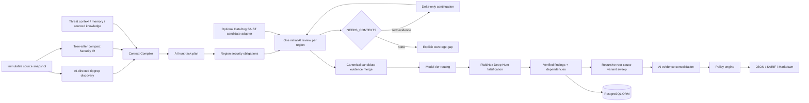

# Code Scanning architecture

## Trust boundary

The engine receives an immutable local source snapshot, codebase identity,
revision, and protected context. Repository contents and model/scanner outputs
are untrusted data. The worker never executes target code or reads tracked
secret containers. All context is size bounded and redacted before it reaches a
model, cache, log, database evidence row, or report.

SCM acquisition and feedback are outside this architecture.

## Runtime

The current runtime below still uses Tree-sitter and AI-directed `rg`.
The accepted replacement is documented in
[Graphify-backed investigations](../PLAN.md#graphify-backed-investigations-for-code-scanning): Graphify
for structural navigation, a graph-first Context Broker, and bounded AI
investigations. Independent Deep Hunt, exact grounding, and recursive variant
search remain mandatory. This diagram is not a claim that the replacement is
already deployed.



## Discovery and code reading

In the current runtime, `rg` is the primary discovery/navigation mechanism. The LLM creates bounded
queries from the codebase architecture, hunt task, business context, threat
context, and retrieved knowledge. Query definitions and response schemas are
versioned assets; they are not embedded in orchestration code.

Tree-sitter maintains a compact Security IR containing only files, stable
symbols, imports, calls, routes, and security facts required for context
expansion and invalidation. The system does not persist a complete AST. When a
question requires stronger flow proof, the agent requests targeted semantic or
taint analysis for the relevant path instead of analyzing the whole codebase.

```text
rg hit
  -> enclosing symbol
  -> relevant imports/definitions
  -> callers and callees
  -> route, guard, source, sink, and control facts
  -> bounded code slice
  -> AI reasoning
  -> optional targeted flow proof
```

Each `DiscoveryRegion` has an immutable source/IR identity and a deterministic
set of obligations derived from the AI hunt plan's invariants, entry points,
evidence requirements, falsification requirements, and sensitive effects. The
model must disposition every obligation as `NO_ISSUE`, `NOT_APPLICABLE`,
`CANDIDATE_FOUND`, `NEEDS_CONTEXT`, or `UNRESOLVED`. Only `NEEDS_CONTEXT` can
request another call. The Context Broker resolves a typed request through
ripgrep, Tree-sitter Security IR, source policy, or stored knowledge. An empty
or repeated result becomes an explicit coverage gap; it never causes another
reasoning pass. A continuation receives the region identity, root-cause
summaries, unresolved obligations, and newly resolved context, without
resending the original source region.

Candidates are merged by structural root, security control, broken invariant,
and gained capability before verification starts. A `CandidateEvidencePacket`
then carries the root cause, attacker origins, boundary, downstream branches,
sensitive effects, trace, capabilities, and remaining evidence gaps into Deep
Hunt.

## Verdict ownership

`PlaidNoxDeepHuntAgent` performs attacker-first analysis: establish an attacker
controlled entry point, trace the path, inspect controls and sanitization,
attempt to disprove exploitability, and retain only evidence that survives.
Every candidate receives this review. A parser, text hit, imported scanner, web
search, memory, or confidence threshold cannot promote a candidate to a finding.

Verified root causes trigger variant sweeps until no new evidence is found. A
strict-schema model pass may consolidate only equivalent findings, and every
input fingerprint must remain represented exactly once.

Routing records a provider-neutral task class and FAST/STANDARD/DEEP model tier and
the knowledge action is chosen deterministically. It never decides to bypass Deep Hunt.

## Persistence

PostgreSQL is the production store through SQLAlchemy repositories. The live
runtime persists snapshots, Security IR, memories, knowledge, hunt plans/tasks,
findings, evidence, and exact symbol dependencies. The schema reserves typed
model/cache audit and threat-context tables for their later runtime writers.
Full snapshots and large artifacts stay in encrypted object storage.

The SQLite adapters are limited to explicit local operation and isolated tests.

## Finding lifecycle

```text
DISCOVERED -> VALIDATED -> OPEN -> IN_PROGRESS -> FIXED -> VERIFIED -> CLOSED
                      \-> FALSE_POSITIVE | ACCEPTED_RISK | DUPLICATE
```

`VALIDATED` requires a complete PlaidNox Deep Hunt verdict and evidence. Policy
is applied after validation and cannot convert incomplete analysis into a pass.
